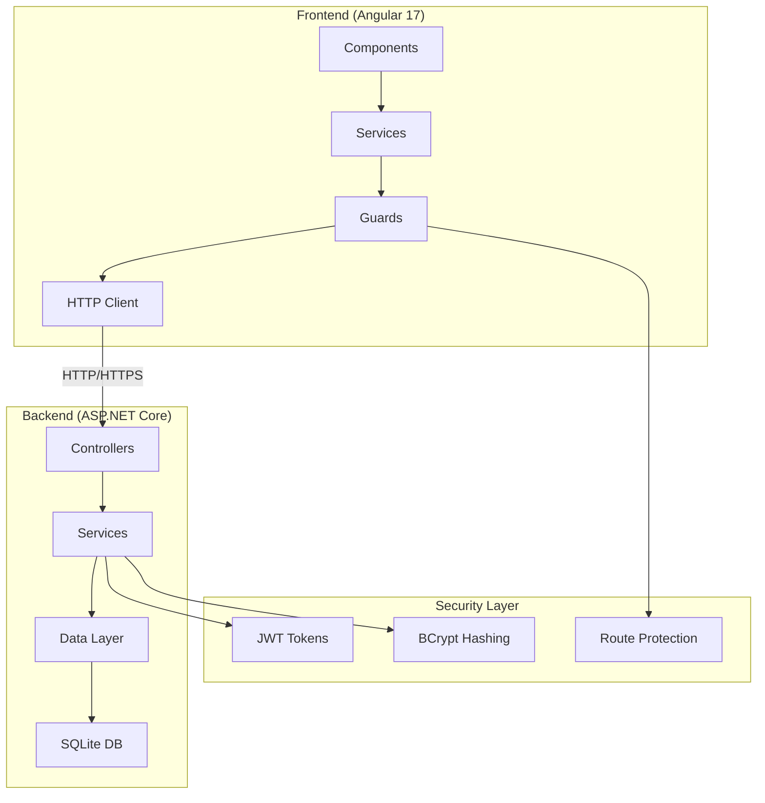
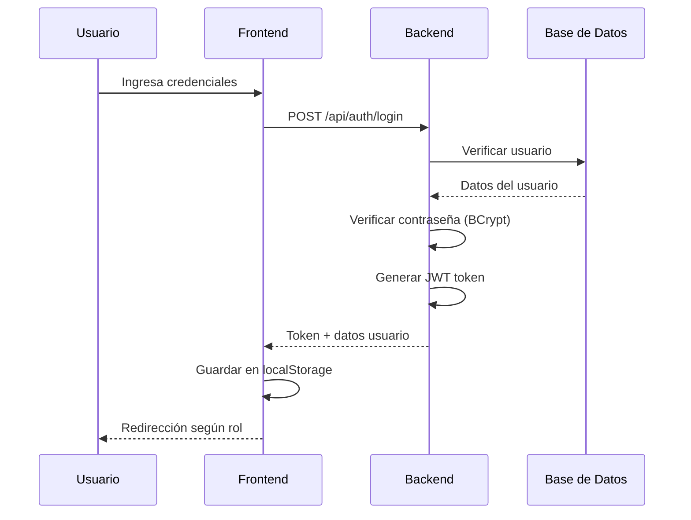
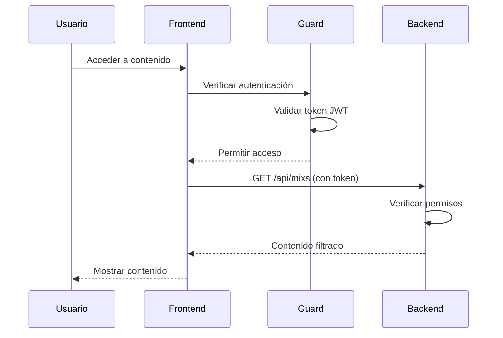

# 🥋 WayCombat - Sistema de Gestión para Academia de Artes Marciales

<div align="center">


Una aplicación web full-stack moderna para la gestión integral de academias de artes marciales, con sistema de autenticación, gestión de contenido y acceso diferenciado por roles.

[🚀 Demo en Vivo](#) | [📖 Documentación](#instalación) | [🐛 Reportar Bug](https://github.com/Camilo-Silva/WayCombat/issues)

</div>

## 📋 Tabla de Contenidos

- [Características Principales](#-características-principales)
- [Stack Tecnológico](#️-stack-tecnológico)
- [Arquitectura del Sistema](#-arquitectura-del-sistema)
- [Estructura del Proyecto](#-estructura-del-proyecto)
- [Flujo de la Aplicación](#-flujo-de-la-aplicación)
- [Sistema de Autenticación](#-sistema-de-autenticación)
- [Instalación](#-instalación)
- [Configuración](#️-configuración)
- [Uso de la Aplicación](#-uso-de-la-aplicación)
- [API Endpoints](#-api-endpoints)
- [Deployment](#-deployment)
- [Contribución](#-contribución)

## ✨ Características Principales

### 🎯 Funcionalidades Core
- **Sistema de Autenticación JWT** con roles diferenciados (Usuario/Admin)
- **Gestión de Capacitaciones** con contenido multimedia organizado
- **Galería Multimedia** categorizada por tipos de entrenamiento
- **Panel de Administración** para gestión completa del contenido
- **Acceso Exclusivo** para instructores con contenido especializado
- **Gestión de Perfiles** de usuario personalizable

### 🔒 Seguridad
- Autenticación basada en JWT tokens
- Contraseñas hasheadas con BCrypt
- Guards de protección de rutas
- Validación de entrada en todas las capas
- CORS configurado para múltiples entornos

### 📱 Experiencia de Usuario
- Diseño responsive con Bootstrap 5
- Interfaz moderna con FontAwesome
- Navegación intuitiva y accesible
- Componentes standalone para mejor rendimiento

## 🛠️ Stack Tecnológico

### Frontend
```
🅰️ Angular 17 (Standalone Components)
🎨 Bootstrap 5 + FontAwesome
📱 Responsive Design
🔄 Reactive Forms
🛡️ Route Guards
🌐 HTTP Client con Interceptors
```

### Backend
```
🟣 ASP.NET Core 9.0 Web API
🗃️ Entity Framework Core 9.0.8
🔐 JWT Authentication
🔒 BCrypt Password Hashing
📊 SQLite Database
🌐 CORS habilitado
```

### Base de Datos
```
🗄️ SQLite (Development)
📦 Code First Migrations
🔄 Transaccional con WAL mode
👤 Seeder con usuario administrador
```

### DevOps & Tools
```
📚 Git Version Control
🐙 GitHub Repository
🚀 Ready for Netlify + Render
📝 Comprehensive Documentation
```

## 🏗️ Arquitectura del Sistema



## 📁 Estructura del Proyecto

```
WayCombat/
├── 📂 Frontend/waycombat-frontend/          # Angular Application
│   ├── 📂 src/app/
│   │   ├── 📂 components/                   # UI Components
│   │   │   ├── 📂 home/                     # Página principal
│   │   │   ├── 📂 galeria/                  # Galería multimedia
│   │   │   ├── 📂 capacitaciones/           # Gestión de entrenamientos
│   │   │   ├── 📂 mi-cuenta/                # Perfil de usuario
│   │   │   ├── 📂 mixs/                     # Lista de contenido
│   │   │   ├── 📂 mix-detalle/              # Detalle de contenido
│   │   │   ├── 📂 acceso-instructores/      # Login/Register
│   │   │   ├── 📂 contacto/                 # Información de contacto
│   │   │   └── 📂 shared/                   # Componentes reutilizables
│   │   │       ├── 📂 header/               # Navegación principal
│   │   │       └── 📂 footer/               # Pie de página
│   │   ├── 📂 services/                     # Servicios Angular
│   │   │   ├── 📄 auth.service.ts           # Autenticación
│   │   │   ├── 📄 mix.service.ts            # Gestión de contenido
│   │   │   └── 📄 usuario.service.ts        # Gestión de usuarios
│   │   ├── 📂 models/                       # Interfaces TypeScript
│   │   ├── 📂 guards/                       # Protección de rutas
│   │   └── 📄 app.routes.ts                 # Configuración de rutas
│   └── 📄 package.json                      # Dependencias Node.js
│
├── 📂 Backend/WayCombat.Api/                # ASP.NET Core API
│   ├── 📂 Controllers/                      # API Controllers
│   │   ├── 📄 AuthController.cs             # Autenticación
│   │   ├── 📄 MixsController.cs             # Gestión de contenido
│   │   ├── 📄 UsuarioController.cs          # Gestión de usuarios
│   │   └── 📄 AdminController.cs            # Panel de administración
│   ├── 📂 Services/                         # Lógica de negocio
│   │   ├── 📄 TokenService.cs               # Gestión JWT
│   │   ├── 📄 UsuarioService.cs             # Servicios de usuario
│   │   └── 📄 MixService.cs                 # Servicios de contenido
│   ├── 📂 Models/                           # Entidades del dominio
│   │   ├── 📄 Usuario.cs                    # Modelo de usuario
│   │   ├── 📄 Mix.cs                        # Modelo de contenido
│   │   ├── 📄 ArchivoMix.cs                 # Archivos multimedia
│   │   └── 📄 AccesoMix.cs                  # Control de acceso
│   ├── 📂 DTOs/                             # Data Transfer Objects
│   ├── 📂 Data/                             # Contexto de base de datos
│   │   └── 📄 WayCombatDbContext.cs         # Entity Framework Context
│   ├── 📂 Migrations/                       # Migraciones de BD
│   └── 📄 Program.cs                        # Configuración de la app
│
├── 📄 .gitignore                            # Archivos ignorados por Git
├── 📄 README.md                             # Documentación principal
└── 📂 .github/                              # GitHub workflows y docs
```

## 🔄 Flujo de la Aplicación

### 1. Flujo de Autenticación


### 2. Flujo de Acceso a Contenido


## 🔐 Sistema de Autenticación

### Roles de Usuario

#### 👤 **Usuario Regular**
- Acceso a contenido público
- Visualización de galería
- Acceso a capacitaciones asignadas
- Gestión de perfil personal

#### 👨‍💼 **Administrador**
- Todas las funciones de usuario regular
- Panel de administración completo
- Gestión de usuarios y permisos
- Subida y gestión de contenido
- Control de accesos a capacitaciones

### Flujo de Registro
1. **Formulario de Registro**: Email, nombre, contraseña
2. **Validación**: Frontend + Backend validation
3. **Hash de Contraseña**: BCrypt con salt
4. **Creación de Usuario**: Rol por defecto "Usuario"
5. **Login Automático**: Generación de JWT token

### Flujo de Login
1. **Credenciales**: Email y contraseña
2. **Verificación**: Comparación con hash BCrypt
3. **Token JWT**: Generación con claims de usuario y rol
4. **Almacenamiento**: localStorage en frontend
5. **Redirección**: Según rol del usuario

### Gestión de Sesiones
- **Duración del Token**: Configurable (por defecto 24h)
- **Renovación**: Automática en requests
- **Logout**: Limpieza de localStorage
- **Expiración**: Redirección automática al login

## 🚀 Instalación

### Prerrequisitos
```bash
# Node.js (versión 18 o superior)
node --version

# .NET 9.0 SDK
dotnet --version

# Angular CLI
npm install -g @angular/cli
```

### Clonar el Repositorio
```bash
git clone https://github.com/Camilo-Silva/WayCombat.git
cd WayCombat
```

### Configuración del Backend
```bash
# Navegar al directorio del backend
cd Backend/WayCombat.Api

# Restaurar paquetes NuGet
dotnet restore

# Aplicar migraciones de base de datos
dotnet ef database update

# Ejecutar la aplicación
dotnet run
```

La API estará disponible en: `http://localhost:5165`

### Configuración del Frontend
```bash
# Navegar al directorio del frontend
cd Frontend/waycombat-frontend

# Instalar dependencias
npm install

# Ejecutar en modo desarrollo
ng serve
```

La aplicación estará disponible en: `http://localhost:4200`

## ⚙️ Configuración

### Variables de Entorno - Backend

Crear `appsettings.Development.json`:
```json
{
  "ConnectionStrings": {
    "DefaultConnection": "Data Source=waycombat_dev.db"
  },
  "JwtSettings": {
    "SecretKey": "tu-clave-secreta-muy-segura-de-al-menos-32-caracteres",
    "Issuer": "WayCombat",
    "Audience": "WayCombat-Users",
    "ExpirationHours": 24
  },
  "Logging": {
    "LogLevel": {
      "Default": "Information",
      "Microsoft.AspNetCore": "Warning"
    }
  }
}
```

### Configuración de CORS

El backend está configurado para permitir requests desde:
- `http://localhost:4200` (desarrollo)
- `http://localhost:4201-4204` (puertos alternativos)

### Usuario Administrador por Defecto

```
Email: admin@waycombat.com
Contraseña: admin123
Rol: Admin
```

## 📖 Uso de la Aplicación

### Para Usuarios Regulares

1. **Registro/Login**
   - Acceder a "Acceso Instructores"
   - Crear cuenta o iniciar sesión
   - Completar perfil personal

2. **Explorar Contenido**
   - Navegar por la galería multimedia
   - Acceder a capacitaciones asignadas
   - Ver detalles de entrenamientos

3. **Gestión de Perfil**
   - Actualizar información personal
   - Cambiar contraseña
   - Ver historial de accesos

### Para Administradores

1. **Panel de Administración**
   - Acceso completo al dashboard
   - Gestión de usuarios y permisos
   - Estadísticas de uso

2. **Gestión de Contenido**
   - Subir nuevo contenido multimedia
   - Organizar por categorías
   - Asignar accesos a usuarios

3. **Control de Usuarios**
   - Ver lista completa de usuarios
   - Modificar roles y permisos
   - Gestionar accesos a contenido

## 🌐 API Endpoints

### Autenticación
```http
POST /api/auth/login          # Iniciar sesión
POST /api/auth/register       # Registrar usuario
POST /api/auth/logout         # Cerrar sesión
```

### Usuarios
```http
GET    /api/usuario/perfil    # Obtener perfil del usuario
PUT    /api/usuario/perfil    # Actualizar perfil
GET    /api/usuario/mixs      # Contenido del usuario
```

### Contenido (Mixs)
```http
GET    /api/mixs              # Listar contenido disponible
GET    /api/mixs/{id}         # Obtener detalle de contenido
POST   /api/mixs              # Crear nuevo contenido (Admin)
PUT    /api/mixs/{id}         # Actualizar contenido (Admin)
DELETE /api/mixs/{id}         # Eliminar contenido (Admin)
```

### Administración
```http
GET    /api/admin/usuarios    # Listar todos los usuarios
GET    /api/admin/mixs        # Gestión completa de contenido
POST   /api/admin/acceso      # Asignar acceso a contenido
GET    /api/admin/estadisticas # Dashboard de estadísticas
```

## 🚀 Deployment

### Netlify (Frontend)
1. Conectar repositorio de GitHub
2. Configurar build command: `npm run build`
3. Directorio de publicación: `dist/waycombat-frontend`
4. Variables de entorno para API URL

### Render/Railway (Backend)
1. Conectar repositorio de GitHub
2. Dockerfile o build automático de .NET
3. Variables de entorno para JWT y conexión DB
4. Configurar dominio personalizado

### Variables de Entorno de Producción
```bash
# Frontend
VITE_API_URL=https://tu-backend.render.com

# Backend
JWT_SECRET_KEY=clave-secreta-produccion
DATABASE_URL=ruta-a-base-de-datos-produccion
CORS_ORIGINS=https://tu-frontend.netlify.app
```

## 🤝 Contribución

### Flujo de Trabajo
1. Fork del proyecto
2. Crear rama feature: `git checkout -b feature/nueva-funcionalidad`
3. Commit cambios: `git commit -m 'Agregar nueva funcionalidad'`
4. Push a la rama: `git push origin feature/nueva-funcionalidad`
5. Crear Pull Request

### Estándares de Código

#### Frontend (Angular)
- Usar standalone components
- Naming en inglés (sin tildes ni ñ)
- Reactive forms para formularios complejos
- Services con BehaviorSubject para estado

#### Backend (.NET)
- Seguir convenciones C#
- Dependency injection pattern
- Data annotations para validación
- Repository pattern para acceso a datos

### Convenciones de Commit
```
feat: nueva funcionalidad
fix: corrección de bug
docs: cambios en documentación
style: cambios de formato
refactor: refactorización de código
test: agregar o modificar tests
```

## 📄 Licencia

Este proyecto está bajo la Licencia MIT. Ver el archivo [LICENSE](LICENSE) para más detalles.

## 👥 Equipo

- **Camilo Silva** - *Desarrollador Principal* - [@Camilo-Silva](https://github.com/Camilo-Silva)

## 📞 Soporte

- 🐛 **Issues**: [GitHub Issues](https://github.com/Camilo-Silva/WayCombat/issues)
- 📧 **Email**: soporte@waycombat.com
- 💬 **Discusiones**: [GitHub Discussions](https://github.com/Camilo-Silva/WayCombat/discussions)

---

<div align="center">

**⭐ Si este proyecto te fue útil, considera darle una estrella en GitHub ⭐**

Made with ❤️ for the martial arts community

</div>